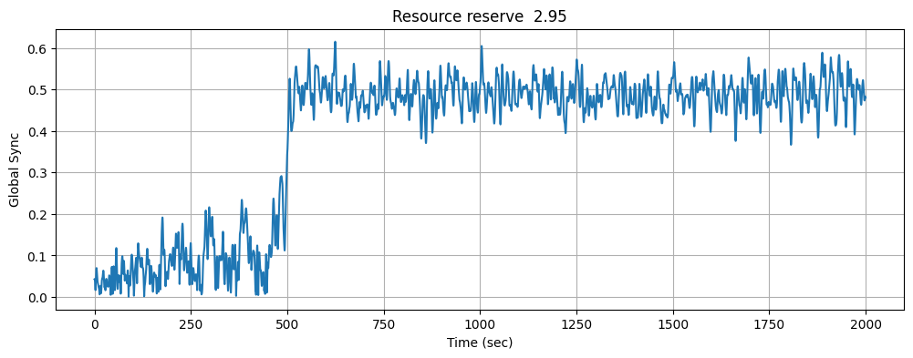
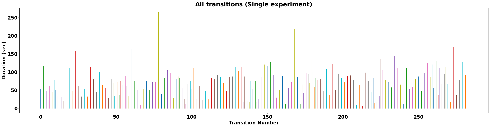
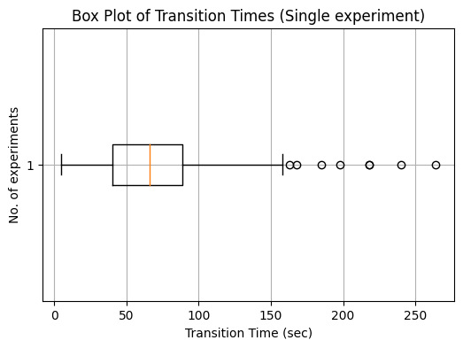
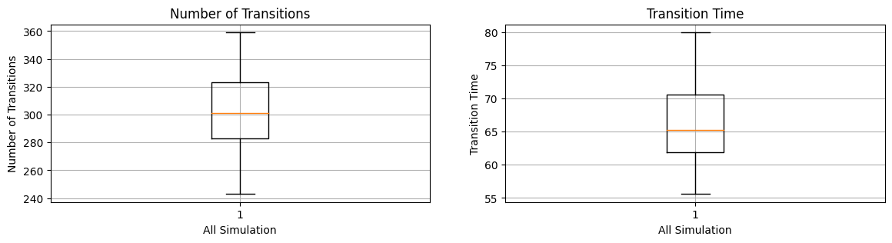
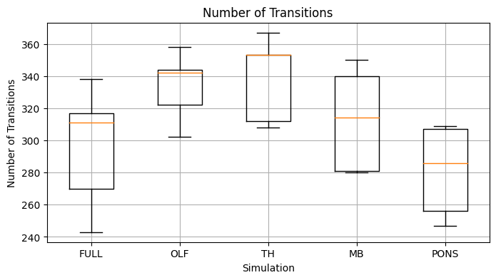
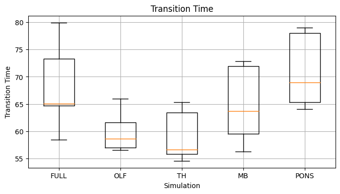

# Ranjith K

## Three major results from the Ranjan et al study

1. Depending on resource availability, states switch between synchronized and unsynchronized. A sudden transition to synchronization initiates a wave like propagation from cortico-thalamic subnetworks to deeper subnetworks.
2. A novel algorithm to analyze the propagation of synchronization across individual nodes (brain areas) within the MBN and identify the key nodes (key brain areas) responsible for this process.
3. The role of network structures in shaping seizure dynamics and the correlation between the hyper-synchronized state and the ratio of resource consumption to recovery rate.

## Key nodes involved in the propagation of synchronization

Cortex, (Orbital, Olfactory), Hippocampus, Striatum, Thalamus, Hypothalamus, Midbrain, Hindbrain.

## Basic model simulation (single iteration)

### How many transitions do you see in a single simulation run?
No. of transitions: 283
  

### How do you define the transition time?
Transition time is the time taken by a system or process to move from one state to another. In the context of this example, it specifically denotes the time taken for various brain regions to transition from a desynchronized state to a synchronized state.

To calculate the transition time, the start time of the state change (desynchronization to synchronization) is recorded, along with the peak time of the transition just before it begins to decline. The transition time is then determined as the difference between the peak time and the start time. This process is repeated for all the observed transitions.

### What is the average transition time you observe? Include units!
Average transition time: 69.15 sec (Epileptic seizures can range from several seconds to several minutes!).

### Include a box plot of the transition times for a single experiment below.

## Basic model simulation (different initial conditions)

### Include two box plots below, one for number of transitions and another for transition time

## Advanced simulations

### Box plot for number of events

### Box plot for transition time

## Interpreting results
The number of transitions is lower when the full network is used for the simulation, but upon removing certain key brain regions, there is an increase in the number of transitions, particularly in the forebrain regions. There are slightly fewer transitions in the midbrain and nearly equal transitions in the hindbrain. With the increasing number of transitions, the average transition time decreases, indicating the absence of longer synchronized behavior. Removal of the hindbrain component doesn't significantly impact the number or average duration of transitions. Global synchronization is high for the full network, whereas there is a decline in global synchrony when specific brain regions are removed.

Intramodular synchrony and intermodular synchrony are two factors that may affect transitions and transition time. They are responsible for local synchrony within modules and global synchrony among brain regions, respectively. Through network analysis, by adjusting the sparsity and density of clusters, we can measure these values and gain insight into the impact of cluster strength on transition behavior. By comparing the values before and after adjustments, we can further enhance our understanding of these dynamics.
