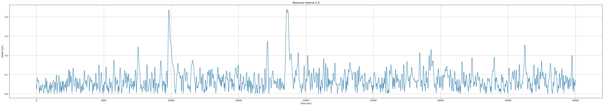

# Ranjith K

## Three major results from the Ranjan et al study

1. Depending on resource availability, states switch between synchronized and unsynchronized. A sudden transition to synchronization initiates a wave like propagation from cortico-thalamic subnetworks to deeper subnetworks.
2. A novel algorithm to analyze the propagation of synchronization across individual nodes (brain areas) within the MBN and identify the key nodes (key brain areas) responsible for this process.
3. The role of network structures in shaping seizure dynamics and the correlation between the hyper-synchronized state and the ratio of resource consumption to recovery rate.

## Key nodes involved in the propagation of synchronization

Cortex, (Orbital, Olfactory), Hippocampus, Striatum, Thalamus, Hypothalamus, Midbrain, Hindbrain.

## Basic model simulation (single iteration)

### How many transitions do you see in a single simulation run?
No. of transitions: 2
  

### How do you define the transition time?
Transition time is the time taken by a system or process to move from one state to another. In the context of this example, it specifically denotes the time taken for various brain regions to transition from a desynchronized state to a synchronized state.

The transition time is calculated as the time when global synchrony start increase upto when it begin to flat (around 90% of the peak time).

### What is the average transition time you observe? Include units!
Average transition time: 92.5 sec (Epileptic seizures can range from several seconds to several minutes!).

### Include a box plot of the transition times for a single experiment below.

## Basic model simulation (different initial conditions)

### Include two box plots below, one for number of transitions and another for transition time

## Advanced simulations

### Box plot for number of events

### Box plot for transition time

## Interpreting results
A commonly observed phenomenon is that when the number of transitions increases, the average duration of transitions tends to be higher (Indicating a prolonged synchronized behavior). Global synchronization is typically high for the full network; however, there is a decline in global synchrony when specific brain regions are removed.

The number of transitions is notably lower when forebrain regions are removed, while the hindbrain region removed network shows a high number of transitions compared to the former. This shows the importance of the forebrain region in maintaining longer synchronization. Furthermore, it has been observed that even in the absence of the hindbrain region, synchronization is still maintained, indicating its lesser significance in synchronization.

Intramodular synchrony and intermodular synchrony are two other factors that may affect transitions and transition time. They are responsible for local synchrony within modules and global synchrony among brain regions, respectively. Through network analysis, by adjusting the sparsity and density of clusters, we can measure these values and gain insight into the impact of cluster strength on transition behavior. By comparing the values before and after adjustments, we can further enhance our understanding of these dynamics.
